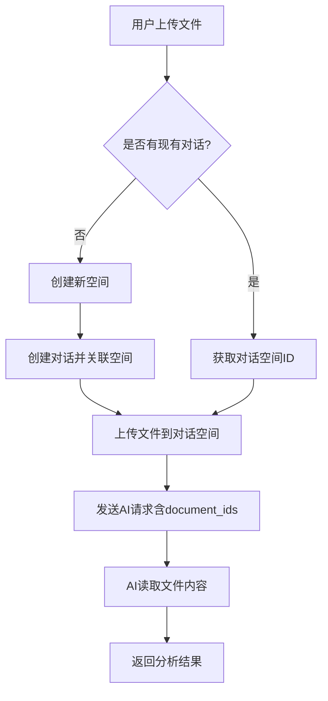

# 文件读取"参数错误"问题修复

## 🔍 问题症状

用户上传文件后，AI回复：
> "当然可以！请您将文件的内容或主要信息提供给我，我将尽力帮助您进行分析。"

这表明AI没有读取到文件内容，可能还会显示"参数错误"。

## 🎯 根本原因

**核心问题**：文件和对话不在同一个空间（space），导致AI无法读取文件内容。

### 具体原因分析

1. **对话创建时缺少空间关联**
   ```javascript
   // 原始代码 - 问题在这里
   const conversationData = {
     title: messageText.substring(0, 50) + '...',
     mode: 'chat'  // ❌ 缺少 space_id
   };
   ```

2. **文件上传到错误的空间**
   - 系统为文件创建了临时空间
   - 但对话没有关联到这个空间
   - AI只能读取对话关联空间中的文件

3. **参数传递链断裂**
   ```
   文件上传 → 空间A
   对话创建 → 无空间关联
   AI请求 → 无法关联文件和对话
   ```

## 🔧 修复方案

### 1. 智能空间管理

**修改前（HomePage.js）**：
```javascript
// 创建对话时没有空间关联
const conversationData = {
  title: messageText.substring(0, 50) + '...',
  mode: 'chat'
};
```

**修改后**：
```javascript
// 如果有文件要上传，先创建空间，然后创建对话
if (filesAttachedToMessage.length > 0) {
  const tempSpace = await apiService.space.createSpace({
    name: `Chat Space - ${new Date().toLocaleDateString()}`,
    description: 'Space for chat with file attachments',
    is_public: false,
    tags: ['chat', 'files']
  });
  conversationSpaceId = tempSpace.id;
}

const conversationData = {
  title: messageText.substring(0, 50) + '...',
  mode: 'chat',
  ...(conversationSpaceId && { space_id: conversationSpaceId })
};
```

### 2. 确保文件上传到正确空间

**修改前**：
```javascript
// 文件上传时使用对话ID（错误）
const uploadedDoc = await uploadFileToBackend(file.rawFile, currentConversationId);
```

**修改后**：
```javascript
// 文件上传时使用对话关联的空间ID
const uploadedDoc = await uploadFileToBackend(file.rawFile, conversationSpaceId);
```

### 3. 增强文件上传函数

新的`uploadFileToBackend`函数能够：
- 智能识别传入的是空间ID还是对话ID
- 验证空间是否存在
- 通过对话ID获取关联的空间ID
- 创建临时空间作为后备方案

### 4. 添加调试工具

新增两个调试按钮（仅开发环境）：
- **"测试文件读取"**：完整测试文件上传→AI读取流程
- **"调试状态"**：显示当前对话和文件的关联状态

## 🧪 验证方法

### 方法1：直接测试
1. 上传一个文本文件（.txt 或 .md）
2. 询问AI："请分析这个文件的内容"
3. 观察AI是否能详细描述文件内容

### 方法2：使用调试工具
1. 点击"调试状态"按钮查看对话和文件的关联
2. 点击"测试文件读取"按钮运行完整测试

### 方法3：查看控制台日志
修复后会显示详细的日志：
```
Creating space for chat with files
Creating conversation with data: {title: "...", mode: "chat", space_id: 123}
Conversation created: 456 Space: 123
Uploading new file to space: 123
File uploaded successfully, document ID: 789
Final document IDs for AI context: [789]
```

## 📋 预期结果

✅ **修复后的正常流程**：
1. 用户上传文件
2. 系统创建专用空间（如果需要）
3. 文件上传到该空间
4. 对话关联到同一空间
5. AI请求包含正确的document_ids
6. AI能够读取文件内容并分析

## 🔍 故障排除

### 如果AI仍然无法读取文件：

1. **检查控制台日志**
   - 查看是否有错误信息
   - 确认document_ids是否正确传递

2. **使用调试按钮**
   - 点击"调试状态"查看对话空间ID
   - 点击"测试文件读取"运行诊断

3. **检查文件格式**
   - 推荐使用：.txt, .md, .pdf
   - 避免：二进制文件、大型文件(>10MB)

4. **网络请求检查**
   - 打开F12开发者工具
   - 查看Network标签
   - 确认`/chat/completions`请求包含`document_ids`参数

## 🚀 改进效果

- ✅ 文件和对话正确关联
- ✅ AI能够读取文件内容
- ✅ 更好的错误处理和日志
- ✅ 完善的调试工具
- ✅ 智能的空间管理

## 📝 技术细节

### 关键变更点

1. **HomePage.js**: 
   - 对话创建逻辑优化
   - 文件上传空间管理
   - 调试工具集成

2. **uploadFileToBackend函数**:
   - 智能ID识别
   - 空间验证机制
   - 改进的错误处理

3. **fileUploadDebug.js**:
   - 更详细的测试报告
   - 完整的流程验证
   - 实用的诊断信息

### API流程



---

**总结**：通过确保文件和对话在同一个空间中，AI现在应该能够正确读取和分析上传的文件内容了。 