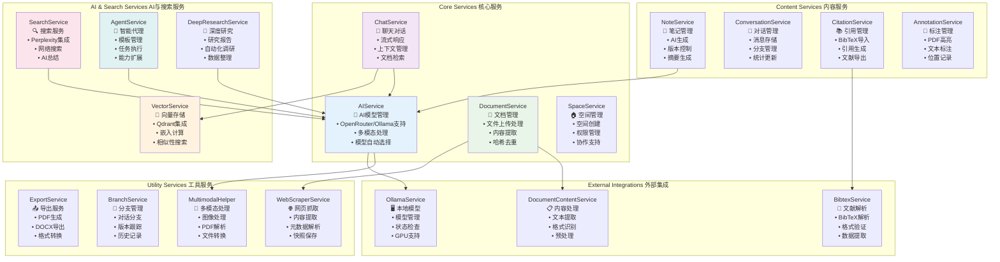

# SecondBrain Service层架构分析

## 整体架构概览

SecondBrain的Service层采用了分层架构和领域驱动设计的方式，将业务逻辑封装在各个专门的服务类中。

```mermaid
graph TB
    subgraph "API Layer"
        A[API Endpoints]
    end
    
    subgraph "Service Layer"
        AI[AIService<br/>AI模型管理]
        CHAT[ChatService<br/>聊天对话]
        DOC[DocumentService<br/>文档管理]
        SPACE[SpaceService<br/>空间管理]
        NOTE[NoteService<br/>笔记管理]
        CONV[ConversationService<br/>对话管理]
        SEARCH[SearchService<br/>搜索服务]
        VECTOR[VectorService<br/>向量存储]
        EXPORT[ExportService<br/>导出服务]
        CITATION[CitationService<br/>引用管理]
        ANNOTATION[AnnotationService<br/>标注管理]
        BRANCH[BranchService<br/>分支管理]
        WEB[WebScraperService<br/>网页抓取]
        MULTIMODAL[MultimodalHelper<br/>多模态处理]
        OLLAMA[OllamaService<br/>本地模型]
        AGENT[AgentService<br/>智能代理]
        DEEP[DeepResearchService<br/>深度研究]
        CONTENT[DocumentContentService<br/>内容处理]
        BIBTEX[BibtexService<br/>文献管理]
    end
    
    subgraph "CRUD Layer"
        CRUD[CRUD Operations]
    end
    
    subgraph "Data Layer"
        DB[(Database)]
        QDRANT[(Qdrant Vector DB)]
        FILES[(File Storage)]
    end
    
    subgraph "External APIs"
        OPENROUTER[OpenRouter API]
        PERPLEXITY[Perplexity API]
        OLLAMA_API[Ollama API]
    end
    
    A --> AI
    A --> CHAT
    A --> DOC
    A --> SPACE
    A --> NOTE
    A --> CONV
    A --> SEARCH
    
    AI --> OPENROUTER
    AI --> OLLAMA_API
    AI --> MULTIMODAL
    
    CHAT --> AI
    CHAT --> VECTOR
    CHAT --> CONV
    
    DOC --> CONTENT
    DOC --> WEB
    DOC --> VECTOR
    
    NOTE --> AI
    SEARCH --> PERPLEXITY
    DEEP --> PERPLEXITY
    
    CITATION --> BIBTEX
    ANNOTATION --> DOC
    
    CONV --> CRUD
    DOC --> CRUD
    SPACE --> CRUD
    NOTE --> CRUD
    
    VECTOR --> QDRANT
    CRUD --> DB
    DOC --> FILES
    
    style AI fill:#e1f5fe
    style CHAT fill:#f3e5f5
    style DOC fill:#e8f5e8
    style VECTOR fill:#fff3e0
```



Service层核心架构图



## Service层架构分析

### 架构模式和设计原则

架构模式：

- 分层架构（Layered Architecture）：Service层位于API层和CRUD层之间，实现业务逻辑的封装

- 领域驱动设计（DDD）：每个服务对应一个业务领域，具有明确的职责边界

- 依赖注入（DI）：服务之间通过构造函数或属性注入依赖关系

设计原则：

- 单一职责原则：每个服务只负责一个特定的业务领域

- 开闭原则：支持扩展（如自定义AI提供商），对修改关闭

- 依赖倒置原则：高层模块不依赖低层模块，都依赖于抽象

### 服务分类和职责

核心业务服务：

- AIService：AI模型管理、多提供商支持（OpenRouter、Ollama、自定义）

- ChatService：聊天对话管理、流式响应、上下文处理

- DocumentService：文档管理、内容提取、哈希去重

- SpaceService：空间管理、权限控制、协作支持

内容管理服务：

- NoteService：笔记管理、AI生成、版本控制

- ConversationService：对话管理、消息存储、分支管理

- CitationService：引用管理、BibTeX导入导出

- AnnotationService：标注管理、PDF高亮、位置记录

AI与搜索服务：

- SearchService：网络搜索、Perplexity集成

- VectorService：向量存储、Qdrant集成、相似性搜索

- AgentService：智能代理、任务执行、模板管理

- DeepResearchService：深度研究、自动化调研

工具服务：

- ExportService：多格式导出（PDF、DOCX）

- BranchService：对话分支管理、版本跟踪

- WebScraperService：网页抓取、内容提取

- MultimodalHelper：多模态处理、图像PDF解析

### 服务依赖关系

依赖层次：

1. 基础层：AIService、VectorService、WebScraperService
2. 业务层：ChatService、DocumentService、NoteService
3. 应用层：ExportService、SearchService、AgentService

关键依赖关系：

- 所有AI功能相关服务都依赖AIService

- ChatService依赖AIService和VectorService进行智能对话

- DocumentService依赖DocumentContentService和WebScraperService

- NoteService依赖AIService进行AI生成和摘要

### 单例模式和全局实例

全局单例实例：

```python
# 每个服务都有全局单例实例
ai_service = AIService()
chat_service = ChatService()
document_service = DocumentService()
vector_service = VectorService()
```

好处：

- 减少内存占用

- 确保状态一致性

- 简化依赖管理

潜在问题：

- 测试困难

- 全局状态管理复杂

- 并发安全需要考虑

### 外部集成

API集成：

- OpenRouter API：多AI模型统一访问

- Perplexity API：网络搜索和深度研究

- Ollama API：本地模型支持

数据存储：

- PostgreSQL：关系型数据存储

- Qdrant：向量数据库

- 文件系统：文档和媒体文件

### 错误处理和监控

错误处理策略：

- 每个服务都有异常处理和日志记录

- 优雅降级（如搜索失败时返回空结果）

- 状态检查和服务可用性监控

监控和诊断：

- get_service_status()函数提供服务状态信息

- 依赖库可用性检查

- 性能指标收集

### 架构优势

优势：

1. 模块化设计：每个服务职责明确，易于维护
2. 可扩展性：支持新的AI提供商和功能扩展
3. 高内聚低耦合：服务内部高度内聚，服务间松耦合
4. 多模态支持：统一的多模态处理能力
5. 灵活配置：支持多种AI模型和提供商切换

需要改进的地方：

1. 依赖管理：可以考虑使用依赖注入框架
2. 异步处理：部分服务可以进一步异步化
3. 缓存策略：可以增加缓存层提高性能
4. 测试友好性：单例模式不利于单元测试

## 快速总结

SecondBrain的Service层采用了成熟的分层架构设计，具有清晰的职责分离和良好的扩展性。通过AI服务作为核心，结合文档管理、对话管理、搜索等功能，构建了一个完整的知识管理系统。架构支持多种AI提供商，具有良好的多模态处理能力，是一个设计合理的现代化服务架构。

## 服务依赖关系详细分析

```mermaid
graph TD
    subgraph "服务依赖关系图"
        AI[AIService<br/>🤖 核心AI服务]
        VECTOR[VectorService<br/>🧠 向量存储]
        CHAT[ChatService<br/>💬 聊天服务]
        DOC[DocumentService<br/>📄 文档服务]
        CONTENT[DocumentContentService<br/>📋 内容处理]
        WEB[WebScraperService<br/>🌐 网页抓取]
        NOTE[NoteService<br/>📝 笔记服务]
        SEARCH[SearchService<br/>🔍 搜索服务]
        CITATION[CitationService<br/>📚 引用服务]
        BIBTEX[BibtexService<br/>📖 文献解析]
        MULTIMODAL[MultimodalHelper<br/>🎨 多模态助手]
        OLLAMA[OllamaService<br/>🖥️ 本地模型]
        AGENT[AgentService<br/>🤖 智能代理]
        DEEP[DeepResearchService<br/>🔬 深度研究]
        BRANCH[BranchService<br/>🌳 分支管理]
        EXPORT[ExportService<br/>📤 导出服务]
        ANNOTATION[AnnotationService<br/>🔖 标注服务]
        CONV[ConversationService<br/>💭 对话服务]
        SPACE[SpaceService<br/>🏠 空间服务]
    end
    
    subgraph "外部依赖"
        OPENROUTER[OpenRouter API]
        PERPLEXITY[Perplexity API]
        QDRANT[Qdrant DB]
        MARKITDOWN[MarkItDown]
    end
    
    subgraph "CRUD层"
        CRUD[CRUD Operations]
    end
    
    %% 核心依赖
    CHAT --> AI
    CHAT --> VECTOR
    NOTE --> AI
    SEARCH --> AI
    AGENT --> AI
    DEEP --> AI
    
    %% 文档处理链
    DOC --> CONTENT
    DOC --> WEB
    
    %% 引用处理
    CITATION --> BIBTEX
    CITATION -.-> DOC
    
    %% AI相关
    AI --> MULTIMODAL
    AI --> OLLAMA
    AI --> OPENROUTER
    
    %% 搜索相关
    SEARCH --> PERPLEXITY
    DEEP --> PERPLEXITY
    
    %% 数据存储
    VECTOR --> QDRANT
    
    %% 可选依赖
    CONTENT -.-> MARKITDOWN
    
    %% CRUD依赖
    CONV --> CRUD
    SPACE --> CRUD
    DOC --> CRUD
    NOTE --> CRUD
    CITATION --> CRUD
    ANNOTATION --> CRUD
    BRANCH --> CRUD
    
    %% 样式
    style AI fill:#e3f2fd,stroke:#1976d2,stroke-width:3px
    style VECTOR fill:#fff3e0,stroke:#f57c00,stroke-width:2px
    style CHAT fill:#f3e5f5,stroke:#7b1fa2,stroke-width:2px
    style DOC fill:#e8f5e8,stroke:#388e3c,stroke-width:2px
    style CRUD fill:#ffebee,stroke:#d32f2f,stroke-width:2px
```




